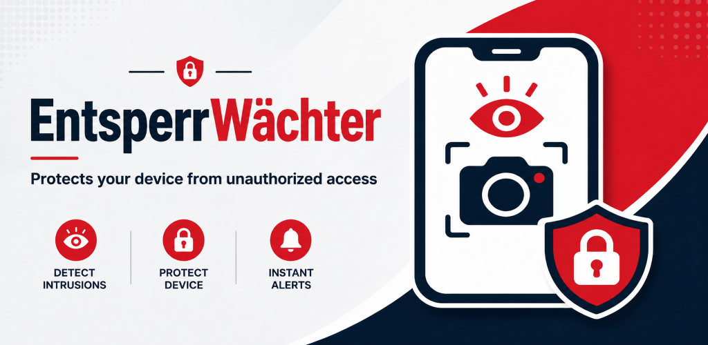

# EntsperrWächter

- [Deutsche Version](#entsperrwächter)
- [English Version](#english-version)

Android-App für eigene Geräte zur transparenten Erfassung von Entsperrereignissen mit optionaler Frontkamera-Aufnahme.

## Tech-Stack

- Android `minSdk 21`, `targetSdk 35`
- Kotlin, Jetpack Compose, DataStore
- Device Admin Receiver für Entsperr-Callbacks, sofern vom System unterstützt
- CameraX im Foreground Service
- Lokale Speicherung über MediaStore

## Entwicklung

1. Projekt in Android Studio öffnen.
2. Gradle-Sync ausführen.
3. Auf einem echten Gerät testen; Emulatoren bilden Sperrbildschirm-, Device-Admin- und Kameraverhalten nur eingeschränkt ab.
4. In der App Setup abschließen:
   - Berechtigungen erteilen
   - Benachrichtigungen erlauben
   - Geräteadministrator aktivieren

## Sprachen

- Deutsch ist die Basisressource unter `app/src/main/res/values/strings.xml`.
- Englisch liegt unter `app/src/main/res/values-en/strings.xml`.
- Neue sichtbare Texte gehören immer in String-Ressourcen, nicht direkt in Compose oder Kotlin.

## Privacy Page auf GitHub Pages

Die Privacy-Templates liegen unter `assets/privacy.html` und `assets/privacy.en.html`.
Sie werden als github page unter https://bj-eberhardt.github.io/entsperr-waechter gehostet.

Dazu ist eine Github Variable `PRIVACY_CONTACT_EMAIL` nötig.

---

# English Version

Android app for your own devices to transparently capture unlock events with optional front camera recording.

## Tech Stack

- Android `minSdk 21`, `targetSdk 35`
- Kotlin, Jetpack Compose, DataStore
- Device Admin Receiver for unlock callbacks where supported by the system
- CameraX in a foreground service
- Local storage via MediaStore

## Development

1. Open the project in Android Studio.
2. Run Gradle sync.
3. Test on a real device; emulators only reflect lockscreen, device admin, and camera behavior to a limited extent.
4. Complete the setup in the app:
   - Grant permissions
   - Allow notifications
   - Enable device admin

## Languages

- German is the base resource under `app/src/main/res/values/strings.xml`.
- English is located under `app/src/main/res/values-en/strings.xml`.
- New visible texts should always be placed in string resources, not directly in Compose or Kotlin.

## Privacy Page on GitHub Pages

The privacy templates are located under `assets/privacy.html` and `assets/privacy.en.html`.
They are hosted as a GitHub Page at https://bj-eberhardt.github.io/entsperr-waechter.

This requires a GitHub variable named `PRIVACY_CONTACT_EMAIL`.
